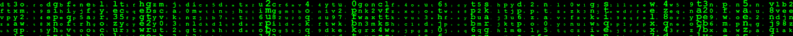

# Extended_square_matrix_class

A practital class to operate on square matrices.

###### [ComplexNumbers_and_Matrices](https://github.com/sananqsh/ComplexNumbers_and_Matrices) was a fine stepping stone for this exercise.
###### Compared to [ComplexNumbers_and_Matrices](https://github.com/sananqsh/ComplexNumbers_and_Matrices):
- +It has more flexibility
- +Has << operator
- +Has transpose() method
- -It doesn`t take commands to do operations on matrices, but if you need to do so, go ahead and code it yourself!
- +For the following methods and also for set_elements method, I did exception-handling:
- +Has [] and ()(int, int) operators for getting rows and elements

